# QEP-000: Quest Enhancement Proposals
## Development Workflow with AI Agents

    Status: Living Document
    Author: Steven Osborn <steven@lolsborn.com>
    Created: 2025-10-05
    Updated: 2025-10-07

## Abstract

This QEP defines the development workflow for Quest, including feature development, bug tracking, specification creation, and testing. The workflow addresses common AI-assisted development challenges through a structured, multi-step, human-in-the-loop process.

## Background: Challenges with AI-Assisted Development

### The Problem with Ad-Hoc AI Coding

When developers give AI agents coding tasks without structure, several problems emerge:

**1. Inconsistent Results**
- Same request produces different solutions across sessions/agents
- Quality varies widely - sometimes excellent, sometimes incomplete
- Difficult to predict what will be delivered

**2. Session Loss and Context Problems**
- Long coding sessions hit token limits and lose context
- Agent forgets earlier decisions or requirements
- Rework happens when session context is lost
- Knowledge doesn't persist between sessions

**3. Communication Breakdowns**
- Vague requirements lead to wrong implementations
- Agent makes assumptions that don't match user intent
- Missing edge cases and error handling

**4. Lack of Specifications**
- No written record of what was requested
- Implementation becomes the documentation (bad practice)
- Hard to review if requirements were met
- Difficult to maintain or extend later

**5. Confidence Problems**
- Hard to verify correctness without deep code review
- Incomplete test coverage leaves blind spots
- Unknown if edge cases are handled

**6. Incomplete Implementations**
- Features work for happy path but fail on errors
- Missing documentation
- No tests or minimal tests
- Doesn't update related files (README, etc.)

### How This Workflow Solves These Problems

**Structured Multi-Step Process:**

```
Request → Spec → Review → Implement → Test → Document → Approve
```

Each step has **clear inputs, outputs, and success criteria**.

**1. Specifications Capture Requirements**
- **QEPs** document what to build before building it
- Written specifications can be reviewed independently
- Prevents misunderstandings early
- Serves as contract between requester and implementer
- Persists across sessions (no context loss)

**2. Multi-Agent Review Process**
- **Spec Review** catches design issues before coding
- **Code Review** ensures implementation matches spec
- Multiple passes improve quality
- Diverse perspectives prevent blind spots

**3. Human-in-the-Loop Checkpoints**
- **Owner** reviews spec for completeness
- **Approver** validates implementation quality
- **Tester** verifies all tests pass
- Human judgment at critical decision points

**4. Automated Quality Gates**
- **Test suite** must pass (automated)
- **Documentation** must be updated (checklist)
- **Consistent patterns** enforced by examples
- **No merge without approval** (CI/CD gates)

**5. Structured Bug Tracking**
- **Bug directories** with reproduction cases
- **Root cause analysis** before fixing
- **Status tracking** (open vs fixed)
- **No silent failures** - all bugs documented

## Roles

### 🤖 AI Agent Roles
- **🔨 Creator** - Creates specifications and implementations
- **🔍 Reviewer** - Reviews specifications, code quality, and completeness
- **📋 Manager** - Coordinates workflow, integrates feedback, manages process

### ⚙️ Automation
- **🧪 Tester** - Runs automated test suite
- **🚀 Publisher** - Automated deployment (CI/CD)

### 👤 Human Roles
- **💡 Requester** - Proposes features, reports bugs
- **👨‍💼 Owner** - Audits specifications and implementations (often same as Requester)
- **✅ Approver** - Final approval for merging

## Development Workflow

The Quest development workflow follows a structured, multi-step process for both features and bugs:

```mermaid
flowchart TD
    A["<b>💡 Requester</b><br/>Feature Request"] --> B["<b>📋 Manager</b><br/>Create Prompt"]
    B --> C["<b>🔨 Creator</b><br/>Create QEP Spec"]
    C --> D["<b>🔍 Reviewer</b><br/>Review Spec"]
    D -->|Needs Changes| E["<b>📋 Manager</b><br/>Integrate Feedback"]
    E --> C
    D -->|Approved| F["<b>👨‍💼 Owner</b><br/>Audit Spec"]
    F -->|Changes Needed| E
    F -->|Approved| G["<b>📋 Manager</b><br/>Setup Branch"]
    G --> H["<b>🔨 Creator</b><br/>Implement Feature"]
    H --> I["<b>🔨 Creator</b><br/>Write Tests & Docs"]
    I --> J["<b>🔍 Reviewer</b><br/>Review Implementation"]
    J -->|Changes Needed| H
    J -->|Approved| K["<b>📋 Manager</b><br/>Create PR"]
    K --> L["<b>🧪 Tester</b><br/>Run Test Suite"]
    L -->|Tests Fail| H
    L -->|Tests Pass| M["<b>✅ Approver</b><br/>Merge to main"]
    M --> N["<b>🚀 Publisher</b><br/>Deploy"]
```



## QEP Flow

1. **Feature Request** - Discuss feasibility, identify scope → Go/No-go decision
2. **Create QEP Specification** - Document in `specs/qep-XXX-feature-name.md` with sections: Abstract, Rationale, API Design, Examples, Implementation Notes, Testing Strategy, Checklist
3. **Spec Review** - Check API clarity, examples, security, error handling, performance
4. **Implementation** - Create types/modules, implement functions/methods, add to appropriate modules
5. **Write Tests** - Cover all public methods, errors, edge cases
6. **Documentation** - Update module docs, CLAUDE.md, and README.md (if user-facing)
7. **Verify** - All tests pass, docs complete, no warnings, checklist complete → Commit

## Bug Flow

1. **Discover Bug** - Triage: Is it reproducible? What's the impact? Is there a workaround?
2. **Create Bug Directory** - `bugs/{NNN}_{name}/` with `description.md` and `example.q`
3. **Write Description** - Sections: Issue, Current/Expected Behavior, Minimal Reproduction, Root Cause, Impact (severity), Related Code, Status
4. **Create Reproduction Script** - Minimal, self-contained Quest code in `example.q` with expected vs actual output
5. **Root Cause Analysis** - Review errors/code, add debug logging, check git history → Document in description.md
6. **Write Failing Test** - Add to test file with comment linking to bug directory
7. **Implement Fix** - Minimal changes to fix root cause, verify tests pass
8. **Update Status** - Prefix directory with `[FIXED]` and move to `bugs/resolved/`, update description.md with fix details
9. **Commit** - Include bug number, root cause, and link to bug directory


## Directory Structure

**Why Store in Code Repository?**

Keeping specifications and bug reports in the codebase (rather than only in external tools like Jira or Notion) provides critical benefits:

- **Full History & Context** - Git preserves complete history of specs and bugs alongside code changes. Humans and AI agents can trace why decisions were made, what was tried, and how solutions evolved.
- **Version Control** - Specs evolve with the code. See exactly what the specification said at any point in history.
- **Searchability** - Full-text search across specs, bugs, and code in one place. AI agents can easily find relevant context.
- **No Context Switching** - Developers and agents work in one environment without jumping between tools.
- **Persistence** - No dependency on external services. Knowledge lives with the code permanently.
- **AI Agent Compatibility** - AI agents can read, search, and reference specs/bugs directly without API integrations.

**Integration with External Tools:** QEPs can be created from Jira tickets, Linear issues, or other project management tools. The key is that the detailed specification lives in the repository where it can be versioned and referenced by both humans and AI agents throughout the development lifecycle.

### For QEPs (Specifications)

```
specs/
  drafts/
    qep-XXX-feature-name.md
  complete/
    qep-XXX-feature-name.md
```

**Naming:** `qep-{NNN}-{kebab-case-name}.md`
**Status:** Draft QEPs go in `specs/drafts/`, completed/implemented QEPs move to `specs/complete/`

### For Bugs

```
bugs/
  {NNN}_{descriptive_name}/
    description.md
    example.q
    notes.md           # Optional
  resolved/
    [FIXED]_{NNN}_{descriptive_name}/
      description.md
      example.q
```

**Naming:** `{NNN}_{snake_case_name}/`
**Status:** Active bugs go in `bugs/`, resolved bugs are prefixed with `[FIXED]` and moved to `bugs/resolved/`

## AI Agent Guidelines

**When creating QEPs:** Research similar modules, include complete examples, plan implementation in detail

**When implementing:** Follow QEP spec exactly, write tests during implementation, use TodoWrite to track progress, update docs, verify tests pass

**When fixing bugs:** Create bug directory first, write reproduction in Quest code, identify root cause before fixing, write failing test, fix and verify

**Quality Standards:**
- Code: Follow Quest patterns, clear errors, proper error handling
- Tests: Descriptive names, cover edge cases, test errors using `std/test`
- Docs: Complete API reference, working examples in Quest syntax

## Checklist Templates

### QEP Implementation Checklist

```markdown
- [ ] QEP specification created
- [ ] Type implementation (if new type)
- [ ] Module implementation (if new module)
- [ ] Methods/functions implemented
- [ ] Tests written using std/test
- [ ] All tests passing
- [ ] Module documentation updated (docs/docs/)
- [ ] CLAUDE.md updated
- [ ] README.md updated (if user-facing)
- [ ] No build warnings
- [ ] Commit with proper message
```

### Bug Fix Checklist

```markdown
- [ ] Bug directory created in bugs/
- [ ] description.md written
- [ ] example.q created
- [ ] Root cause identified
- [ ] Failing test written
- [ ] Fix implemented
- [ ] All tests passing
- [ ] Bug directory prefixed with [FIXED] and moved to bugs/resolved/
- [ ] description.md updated with fix details
- [ ] Commit with proper message
```

## Best Practices

### What Works Well

1. **QEPs prevent scope creep** - Spec forces thinking through edge cases upfront, clear boundary between in-scope and future work
2. **Bug directories create accountability** - Can't ignore bugs, reproduction validates fixes
3. **Test-first development** - Writing tests reveals API awkwardness before implementation
4. **Start QEPs with examples** - Forces user perspective thinking
5. **Bug reproduction first, fix second** - Validates understanding, becomes regression test

### What to Avoid

- ❌ Skipping specs for "small" features (they always grow)
- ❌ Combining multiple changes in one PR (harder to review)
- ❌ Vague bug descriptions without reproduction
- ❌ Testing after implementation (creates confirmation bias)

### When to Use Each Workflow

**Use QEP:** New modules/types, methods, affects multiple files, needs design review
**Skip QEP:** Single-method additions, bug fixes, doc-only changes
**Use Bug Flow:** Behavior mismatches spec, test failures, crashes

## Conclusion

This workflow solves the core challenges of AI-assisted development by treating specifications as first-class artifacts with a multi-step, human-in-the-loop process.

**What this ensures:**
- Quality through specification review before implementation
- Completeness via checklists (tests, docs, etc.)
- Confidence from multiple review stages
- Resilience to session loss (specs persist)
- Clear roles and automation-friendly processes